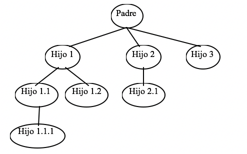
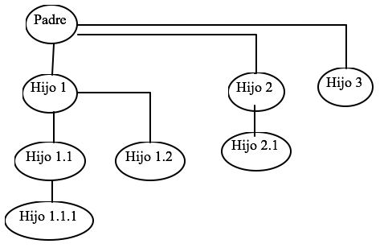

a)	Dibujar un esquema que muestre la jerarquía de procesos si el usuario ejecuta los mandatos “crear_procesos1 3” y  “crear_procesos2 3”  sucesivamente.

* crear_procesos1 3

* crear_procesos2 3

El número de procesos que se crean es el mismo. La diferencia está en que con la llamada a “crear_procesos2” se garantiza que el orden de creación de los procesos es así: 
Padre - Hijo1 - Hijo1.1 - Hijo1.1.1 - Hijo1.2 - Hijo2 - Hijo2.1 - Hijo3
Esto implica que por ejemplo cuando se crea el Hijo1.2 es porque tanto el hijo1.1 como el hijo1.1.1 han terminado ya.
En el caso de “crear_procesos1” no podemos asegurar nada acerca del orden de creación de los procesos.

b)	 ¿Pueden quedar procesos zombies?

Atendiendo a la definición de proceso zombie: es aquel proceso cuya ejecución ha finalizado y su proceso padre (sin haber muerto todavía) no hizo un wait( ) esperando por el hijo.

Según esta definición, si se ejecuta “crear_procesos1” sí pueden quedar procesos zombies, ya que cada proceso padre no hace wait( ) esperando la terminación de los hijos que va creando. No se puede asegurar que habrá procesos zombies siempre, ya que si los hijos creados mueren después del padre que los creó, no se consideran procesos zombies.

Con la ejecución de “crear_procesos2” es seguro que no quedarán procesos zombies, ya que cuando un proceso crea un hijo siempre espera a que termine con la llamada a wait( ).
